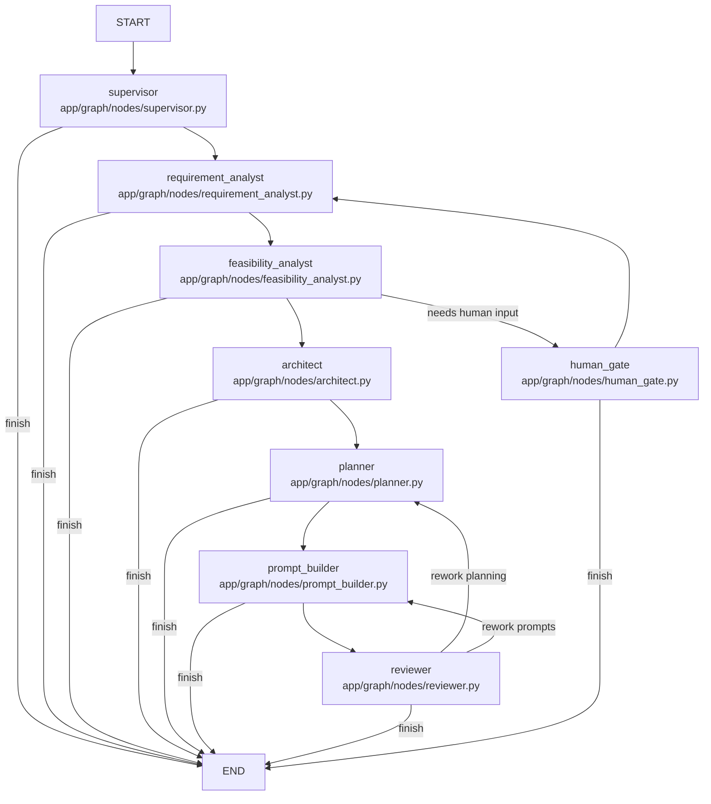

# Project Dev Multi-Agent (MVP)

[中文文档](./README.zh-CN.md)

Requirement-driven multi-agent development scaffold built with LangChain + LangGraph.

Third-party notices: [THIRD_PARTY_NOTICES](./docs/legal/THIRD_PARTY_NOTICES.md)

## Product Highlights

This project turns one-line requirements into execution-ready delivery outputs through a multi-agent workflow.
For simple requests, it can produce a practical plan in one pass, and for ambiguous requests it provides controlled
human-in-the-loop recovery and rework loops.

It is also built for Codex integration:

- start from raw requirements and generate structured outputs ready for implementation
- pass run results to Codex via MCP tools for a seamless "plan-to-code" workflow
- keep checkpoint history and diagnostics so teams can trace and fix quality issues quickly

Core capabilities:

- requirement analysis, feasibility assessment, architecture planning, task decomposition
- coding/test prompt generation with quality checks and fallback strategies
- reviewer-driven rework loops for planner/prompt_builder until convergence
- checkpointed execution with memory/sqlite/postgres backends
- exportable artifacts for summary, architecture, tasks, prompts, and review diagnostics

## Repository Layout

- `app/agents`: specialized agents and schemas
- `app/graph`: graph state, nodes, routes, builder
- `app/tools`: callable tools for agents
- `app/services`: business logic
- `app/storage`: checkpoint and persistence wrappers
- `app/api`: FastAPI routes
- `tests`: test suite

## Quick Start

1. Install dependencies

```bash
pip install -e .[dev]
```

2. Configure environment variables

```bash
cp .env.example .env
```

3. Start service

```bash
python run_dev.py
```

4. Open web console

- `http://127.0.0.1:8000/`

## LLM Provider Switching

- `LLM_PROVIDER=openai|azure_openai|anthropic|google|ollama|openrouter`
- `LLM_MODEL=...`
- `LLM_TEMPERATURE=0.2`
- Optional per-agent model overrides:
  - `REQUIREMENT_LLM_MODEL`
  - `FEASIBILITY_LLM_MODEL`
  - `ARCHITECT_LLM_MODEL`
  - `PLANNER_LLM_MODEL`
  - `PROMPT_BUILDER_LLM_MODEL`
  - `REVIEWER_LLM_MODEL`

Optional extra providers:

```bash
pip install -e .[dev,providers]
```

## MCP Integration (Export Tools)

1. Install MCP dependencies

```bash
pip install -e .[mcp]
```

2. Start MCP server (stdio)

```bash
codex-export-mcp
```

3. Available MCP tools (11)

- `list_export_capabilities`
- `get_run_state_summary(project_id)`
- `get_run_section(project_id, section)`
- `preview_run_export_content(project_id, export_format, sections)`
- `export_run_artifact_tool(project_id, export_format, sections)`
- `export_run_sections_bundle(project_id, export_format, sections)`
- `list_project_exports(project_id, limit)`
- `read_project_export_file(project_id, filename)`
- `start_new_run(raw_requirement, project_id, project_prefix)`
- `continue_run(project_id)`
- `resume_run_with_feedback(project_id, human_feedback)`

## Agent Structure Paths

The core structure is split into an orchestration layer and an agent implementation layer.

- Orchestration layer (LangGraph nodes):
  - `app/graph/nodes/requirement_analyst.py`
  - `app/graph/nodes/feasibility_analyst.py`
  - `app/graph/nodes/architect.py`
  - `app/graph/nodes/planner.py`
  - `app/graph/nodes/prompt_builder.py`
  - `app/graph/nodes/reviewer.py`
  - `app/graph/nodes/human_gate.py`
  - `app/graph/nodes/supervisor.py`
- Agent implementation layer (LLM agent wrappers):
  - `app/agents/requirement_agent.py`
  - `app/agents/feasibility_agent.py`
  - `app/agents/architect_agent.py`
  - `app/agents/planner_agent.py`
  - `app/agents/prompt_builder_agent.py`
  - `app/agents/reviewer_agent.py`
  - `app/agents/supervisor_agent.py`
  - `app/agents/llm.py` (shared model builder and provider routing)

Flow overview:



## Post-processing for Hallucination Reduction

To reduce model hallucination and over-blocking, this project applies post-processing after reviewer output.

- Evidence-based recheck:
  - Blocking issues are re-validated against `task_breakdown` + `prompt_pack` evidence.
  - Claims without enough cross-source support are downgraded instead of kept as hard blockers.
- Two-layer coverage verification:
  - Compact screening first, then full-evidence recheck for uncovered items.
  - This lowers false negatives while keeping token usage controlled.
- Structured dependency validation:
  - Dependency cycle checks are computed from explicit `depends_on` graph, not guessed by LLM text.
  - Cycle/timing claims can be downgraded when structure evidence does not support them.
- Architecture conflict guardrail:
  - Architecture-conflict issues require stronger hard evidence before remaining blocking.
  - Weak/conflicting claims are converted to suggestions with diagnostics.
- Diagnostics and explainability:
  - Review outputs include `diagnostics`, `postprocess_reason_code`, and disposition metadata.
  - This makes downgrade/keep decisions auditable for human reviewers.

Related implementation paths:

- `app/graph/nodes/reviewer.py`
- `app/graph/nodes/common.py`
- `app/services/architecture_conflict_checker.py`

## GitHub Publishing Checklist

1. Ensure no secrets are tracked (`.env` must remain ignored)
2. Run tests:

```bash
pytest
```

3. Check changes:

```bash
git status
```

4. Commit and push:

```bash
git add .
git commit -m "chore: prepare repository for GitHub publishing"
git branch -M main
git remote add origin <your-repo-url>
git push -u origin main
```
